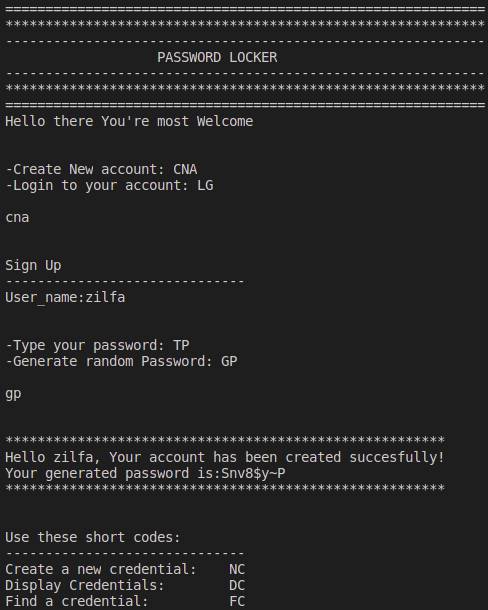

# PASSWORD-LOCKER
## Description
  An application that will help us manage our passwords and even generate new passwords for us.
## Author(s) information
[iamzilfa](https://github.com/iamzilfa)

## Setup/Installation Requirements

* Github acoount
* Git
* Install ubuntu
* Visual code studio
* pyperclip
* pip
* internet network

### Cloning
* Clone [this repository](https://github.com/iamzilfa/Password-Locker)

## BDD
* A user create account with my username and password
* A user store my existing login credentials
* Generate a new credential password

## Picture

## Technologies Used
* Python3.6

## Support and contact details
If anyone need support concerning my project or anything related, just reach out to zilcyam@gmail.com
 

### License

Copyright (c) [2020] [Zilfa Cyamani]

Permission is hereby granted, free of charge, to any person obtaining a copy
of this software and associated documentation files (the "Software"), to deal
in the Software without restriction, including without limitation the rights
to use, copy, modify, merge, publish, distribute, sublicense, and/or sell
copies of the Software, and to permit persons to whom the Software is
furnished to do so, subject to the following conditions:

The above copyright notice and this permission notice shall be included in all
copies or substantial portions of the Software.

THE SOFTWARE IS PROVIDED "AS IS", WITHOUT WARRANTY OF ANY KIND, EXPRESS OR
IMPLIED, INCLUDING BUT NOT LIMITED TO THE WARRANTIES OF MERCHANTABILITY,
FITNESS FOR A PARTICULAR PURPOSE AND NONINFRINGEMENT. IN NO EVENT SHALL THE
AUTHORS OR COPYRIGHT HOLDERS BE LIABLE FOR ANY CLAIM, DAMAGES OR OTHER
LIABILITY, WHETHER IN AN ACTION OF CONTRACT, TORT OR OTHERWISE, ARISING FROM,
OUT OF OR IN CONNECTION WITH THE SOFTWARE OR THE USE OR OTHER DEALINGS IN THE
SOFTWARE.